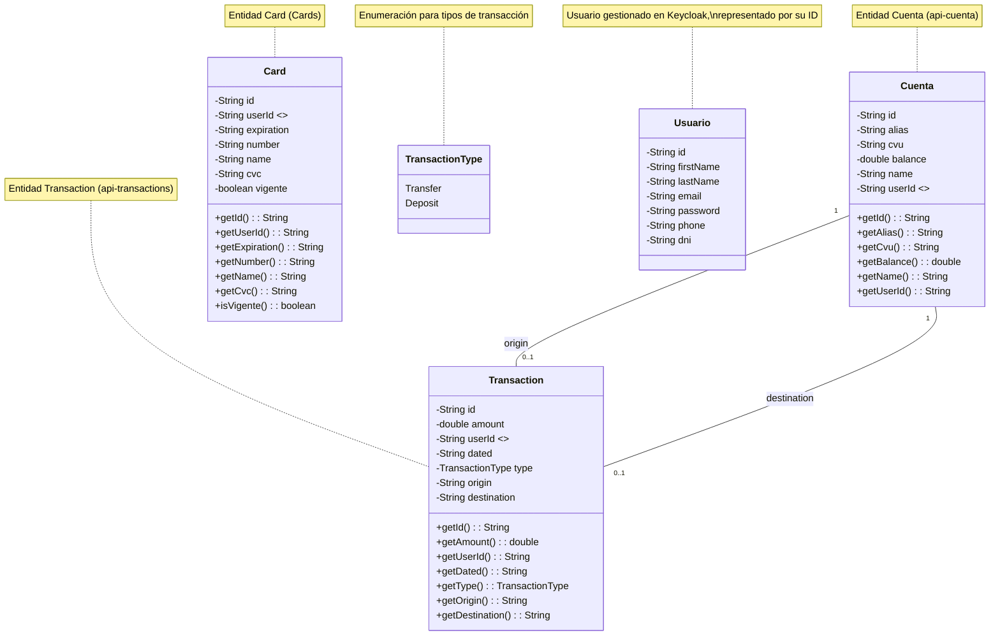

# Desafío Profesional Backend - Digital Money House

Desarrollo de una REST API para una billetera virtual que permite a los usuarios gestionar cuentas, realizar transferencias, administrar tarjetas de débito/crédito y consultar su historial de transacciones.  El sistema está construido con una arquitectura de microservicios utilizando Java, Spring Boot, Spring Cloud, Keycloak, y otras tecnologías modernas.

- Desarrollado por [Gustavo Dagoberto](https://github.com/GustavoDago).
## Contenido
- [Tecnologías](#tecnología)
- [Estructura](#estructura)
- [Requisitos](#requisitos)
- [Instalación y configuración](#instalación-y-configuración) 
- [Ejecución de la aplicación](#ejecución-de-la-aplicación)
- [Uso de la API (Endpoints)](#uso-de-la-api-endpoints)
  - [Cuentas (api-cuenta)](#cuentas)
  - [Usuarios (api-usuario)](#usuarios)
  - [Tarjetas (Cards)](#card)
  - [Transacciones (api-transactions)](#transacciones)
-  Testing
  - [Tests unitarios](#tests-unitarios)
  - [Tablas de Casos de Prueba](#tablas-de-casos-de-prueba)
    - [api-usuario](#api-usuario)
    - [PostMan](#postman)
## Tecnología
* **Spring Boot:**  Framework para crear aplicaciones Java de forma rápida, simplificando la configuración y el despliegue.
*   **Spring Cloud:**  Conjunto de herramientas para construir sistemas distribuidos (microservicios), incluyendo:
    * **Spring Cloud Config:**  Servidor de configuración centralizada para todos los microservicios.
    * **Spring Cloud Gateway:**  Actúa como puerta de entrada única (API Gateway) para todas las peticiones.
    * **Spring Cloud Netflix Eureka:**  Servicio de descubrimiento para que los microservicios se encuentren entre sí.
    * **Spring Cloud OpenFeign:**  Cliente REST declarativo para facilitar la comunicación entre microservicios.
*   **Keycloak:**  Servidor de identidad y acceso (IAM) de código abierto para la gestión de usuarios, autenticación y autorización.
*   **JWT (JSON Web Token):**  Estándar para la creación de tokens de acceso que se utilizan para la autenticación y autorización en la API.
*   **JPA (Java Persistence API) / Hibernate:**  Frameworks para la persistencia de datos en bases de datos relacionales (MySQL).
*   **MySQL:**  Sistema de gestión de bases de datos relacional utilizado para almacenar datos de cuentas, transacciones y tarjetas.
*   **Docker / Docker Compose:**  Herramientas para la contenerización y orquestación de la aplicación, facilitando el despliegue y la ejecución en diferentes entornos.
*   **Lombok:** Librería para reducir el código repetitivo.
*   **Mermaid:** Para diagramas.
## Estructura
### Diagrama UML de clases
Centrado en las entidades de las bases de datos y mostrando cómo representamos la relación con el usuario gestionado en Keycloak.

### Diagrama de arquitectura general del sistema
```mermaid
graph LR
    subgraph Cliente [Cliente]
        A[Usuario Final] --> B(Navegador o App)
    end

    B -- HTTPS, JWT --> C[API Gateway]

    subgraph Microservicios
        C -- Enruta, Valida JWT, Feign --> D[API Usuario]
        C -- Enruta, Valida JWT, Feign --> E[API Cuenta]
        C -- Enruta, Valida JWT, Feign --> F[API Transacciones]
        C -- Enruta, Valida JWT, Feign --> G[Servicio Cards]
        D -- Feign --> E
        F -- Feign --> D
        F -- Feign --> E
        G -- Feign --> D
        H[Servidor Configuracion] -- Configuracion --> D
        H -- Configuracion --> E
        H -- Configuracion --> F
        H -- Configuracion --> G
        H -- Configuracion --> C
        I[Servidor Eureka] -- Registro y Descubrimiento --> D
        I -- Registro y Descubrimiento --> E
        I -- Registro y Descubrimiento --> F
        I -- Registro y Descubrimiento --> G
        I -- Registro y Descubrimiento --> C
    end

    subgraph Bases de Datos
        D -- JPA/Hibernate --> J[Base Datos Keycloak - MySQL]
        E -- JPA/Hibernate --> K[Base Datos Cuenta - MySQL]
        F -- JPA/Hibernate --> L[Base Datos Transacciones - MySQL]
        G -- JPA/Hibernate --> M[Base Datos Cards - MySQL]
    end

      subgraph KeycloakContenedor [Contenedor Keycloak]
        D -- Keycloak Admin API --> N[Keycloak]
        N -- JDBC --> J
      end

    subgraph ConfiguracionExterna
      O[Repositorio GitHub Configuracion] --> H
    end

    style C fill:#f9f,stroke:#333,stroke-width:2px
    style D fill:#ccf,stroke:#333,stroke-width:2px
    style E fill:#ccf,stroke:#333,stroke-width:2px
    style F fill:#ccf,stroke:#333,stroke-width:2px
    style G fill:#ccf,stroke:#333,stroke-width:2px
    style H fill:#cff,stroke:#333,stroke-width:2px
    style I fill:#cff,stroke:#333,stroke-width:2px
    style J fill:#ffc,stroke:#333,stroke-width:2px
    style K fill:#ffc,stroke:#333,stroke-width:2px
    style L fill:#ffc,stroke:#333,stroke-width:2px
    style M fill:#ffc,stroke:#333,stroke-width:2px
    style N fill:#fcf,stroke:#333,stroke-width:2px
    style O fill:#fcc,stroke:#333,stroke-width:2px
````
**Explicación del Diagrama y Relaciones:**
1.  **Cliente (Frontend/App):**
    *   Representa la aplicación cliente (navegador web, aplicación móvil) que interactúa con el sistema.
    *   Se comunica con el `api-gateway` a través de HTTPS, enviando peticiones que incluyen un token JWT en el encabezado `Authorization`.
2.  **API Gateway (`api-gateway`):**
    *   **Punto de entrada único:** Todas las peticiones externas pasan por aquí.
    *   **Enrutamiento:** Dirige cada petición al microservicio adecuado según la URL.
    *   **Autenticación y Autorización:**
        *   Valida el token JWT (usando Spring Security y la configuración de Keycloak).
        *   Verifica que el usuario tenga los permisos (roles) necesarios.
    *   **Comunicación con Microservicios:** Utiliza Feign Clients para reenviar las peticiones a los microservicios, incluyendo el token JWT.
3.  **Microservicios (`api-usuario`, `api-cuenta`, `api-transactions`, `Cards`):**
    *   Cada microservicio se encarga de una parte específica de la lógica de negocio.
    *   **Comunicación entre Microservicios (Feign):**
        *   `api-usuario` se comunica con `api-cuenta` (para obtener el nombre al crear una cuenta).
        *   `api-transactions` se comunica con `api-usuario` (para obtener datos del usuario) y con `api-cuenta` (para actualizar saldos).
        *   `Cards` se comunica con `api-usuario` (para verificar la existencia del usuario).
        *   Esta comunicación se realiza a través de Feign Clients (interfaces declarativas que Spring Cloud OpenFeign convierte en clientes REST).  El gateway pasa el token JWT a los microservicios, y estos lo usan en sus llamadas Feign.
    *   **Configuración (Config Server):**  Cada microservicio obtiene su configuración del `config-server`. El `config-server` lee la configuración desde un repositorio Git (GitHub en este caso).
    * **Registro y descubrimiento (Eureka):** Cada microservicio se registra con `eureka-server`, se comunica y es encontrado a través del mismo.
4.  **Bases de Datos:**
    *   Cada microservicio (excepto `api-usuario`) tiene su propia base de datos MySQL.
    *   La interacción con la base de datos se realiza a través de JPA (Java Persistence API) con Hibernate como implementación.  Spring Data JPA simplifica aún más el acceso a datos.
    *   `api-usuario` *no* tiene su propia base de datos.  Gestiona los usuarios *directamente* en Keycloak.
5.  **Keycloak (Contenedor):**
    *   Keycloak se ejecuta en su propio contenedor Docker (según el `docker-compose.yml`).
    *   `api-usuario` utiliza la API de administración de Keycloak (a través de la biblioteca cliente de Keycloak) para crear, actualizar y eliminar usuarios.
    *   Keycloak, a su vez, utiliza la base de datos MySQL (`mysql-kc`) para almacenar su propia información (usuarios, roles, configuraciones, etc.). La conexión entre Keycloak y su base de datos es a través de JDBC.
6. **Configuración externa (GitHub):**
    * El `config-server` lee la configuración de la aplicación desde un repositorio de git.
* **Detalles Adicionales Importantes:**
*   **JWT (JSON Web Token):**  El mecanismo principal para la autenticación y autorización.  El cliente obtiene un token JWT al iniciar sesión en `api-usuario` (que interactúa con Keycloak).  Este token se incluye en cada petición posterior, y es validado por el gateway y los microservicios.
*   **Spring Security:**  Se utiliza en el gateway y en cada microservicio para validar el token JWT, extraer la información del usuario (roles, etc.) y aplicar políticas de autorización (por ejemplo, permitir acceso solo a usuarios con ciertos roles).  Las clases `WebSecurityConfig`, `JwtAuthConverter` y `JwtDecoderConfig` en cada microservicio configuran Spring Security.
*   **Feign Clients:**  Simplifican la comunicación entre microservicios.  Se definen interfaces (como `UserFeignClient`, `CuentaFeignClient`) y Spring Cloud OpenFeign se encarga de generar la implementación que realiza las llamadas HTTP.  El token JWT se propaga automáticamente a través de Feign (gracias a la configuración de `RequestInterceptor`).
*   **Docker Compose:** Facilita la ejecución local de la aplicación, creando los contenedores necesarios para Keycloak y la base de datos MySQL.

## Requisitos
+ Java 17 o posterior
+ Maven
+ Docker y Docker compose
+ Un IDE (Preferiblemente IntelliJ IDEA)
+ Git
+ Cliente de bases de datos MySQL
## Instalación y Configuración
+ Clonar el repositorio:
```bash
  git clone https://github.com/GustavoDago/wallet-personal-desafio-backend
```
+ Crear en la raíz un archivo .env, y agregarle la siguiente línea:
```
KEYCLOAK_ADMIN_PASSWORD=admin@1234
```
+ Configuración de KeyCloak:
  1. En la raíz del proyecto debe haber un archivo llamado docker-compose.yml.
  2. En esa carpeta, ejecutar
    ```bash
        docker-compose up.
    ````
  3. Esperar a que se activen los contenedores.
  4. Ir a localhost:9081. Puede hacerlo también desde Docker Desktop.
  5. Debe aparecer la pantalla de login de Keycloak.
  6. Escribir Usuario: admin y Password: admin@1234
  7. Dentro de Keycloak, buscar el select de realms, que debería decir 'Keycloak'.
  8. Pulsar botón 'Create realm'.
  9. En la pantalla de 'Create realm', pulsar botón 'Browse'.
  10. Buscar, en la carpeta raíz del proyecto, el archivo 'realm-export.json'. Pulsar 'Create'.
  11. Seleccionar realm 'spring'.
  12. Seleccionar Clients -> app-wallet.
  13. En pestaña 'Credentials', pulsar ClientSecret -> Regenerate.
  14. Pulsar 'copy to clipboard'.
  15. En el application.yml de api-usuario, api-cards, api-transactions y api-cuenta, reemplazar el valor de
  ```yml
        app:
        keycloak:
          admin:
            clientSecret:
  ```
       por el clientSecret copiado de Keycloak.
+  Configuración de MySQL:
   - Dentro de MySQL workbenck, pulsar botón 'Create a new schema in the connected server'
   - Ponerle de nombre: cuenta_db
   - Repetir dos veces más, creando schemas llamados transactions_db y cards_db
   - Revisar en los application.yml de api-cuenta, api-cards y api-transactions 
   el nombre de las bases de datos. Corregir si hace falta.
   ```yml
   spring:
    datasource:
      url: jdbc:mysql://${DB_HOST:localhost}:${DB_PORT:3306}/(NOMBRE BASE DE DATOS)
   ```
## Ejecución de la aplicación
1. En la raíz revisar que exista el archivo *docker-compose.yml*. Abrir terminal, y ejecutar
```bash
  docker-compose up
```
2. ConfigServerApplication
2. ApiEurekaApplication
3. ApiGatewayApplication
4. api-usuario, api-cuenta, api-transactions y api-cards se cargan sin orden.

## Uso de la API (Endpoints)

### Cuentas
Esta sección describe los endpoints disponibles en el microservicio `api-cuenta`.  Todos los endpoints requieren un token JWT válido en el encabezado `Authorization`, con el formato `Bearer <token>`, *excepto* donde se indique lo contrario.

| Método   | URL                                    | Descripción                                      | Parámetros                                                                                                                                                              | Request Body                                        | Respuestas                                                                                                                                                                              |
|:---------|:---------------------------------------|:-------------------------------------------------|:------------------------------------------------------------------------------------------------------------------------------------------------------------------------|:----------------------------------------------------|:----------------------------------------------------------------------------------------------------------------------------------------------------------------------------------------|
| `GET`    | `/accounts`                            | Obtiene todas las cuentas.                       | *Ninguno*                                                                                                                                                               | *Ninguno*                                           | **200 OK:**  Devuelve un array de objetos `Cuenta`.  <br>  ```json  [ { "id": "string", "alias": "string", "cvu": "string", "balance": 0, "name": "string", "userId": "string" } ]  ``` |
| `POST`   | `/users/{userId}/accounts`             | Crea una nueva cuenta para un usuario.           | **`userId`** (path, obligatorio): ID del usuario. <br> **`Authorization`** (header, obligatorio): Token JWT.                                                            | *Ninguno*                                           | **200 OK:** Devuelve la cuenta creada. <br> `200 OK` Devuelve un objeto.                                                                                                                |
| `GET`    | `/users/{userId}/accounts`             | Obtiene la cuenta de un usuario específico.      | **`userId`** (path, obligatorio): ID del usuario.  <br> **`Authorization`** (header, obligatorio): Token JWT.                                                           | *Ninguno*                                           | **200 OK:** Devuelve la cuenta del usuario. <br> `200 OK` Devuelve un objeto.                                                                                                           |
| `PUT`    | `/users/{userId}/accounts/{accountId}` | Actualiza el saldo de una cuenta.                | **`userId`** (path, obligatorio): ID del usuario. <br> **`accountId`** (path, obligatorio): ID de la cuenta. <br> **`Authorization`** (header, obligatorio): Token JWT. | `RecordAccount`: Objeto con los datos a actualizar. | **200 OK:** Devuelve un objeto que representa la cuenta actualizada.                                                                                                                    |
| `PATCH`  | `/users/{userId}/accounts/1`           | Actualiza la cuenta.                             | **`userId`** (path, obligatorio): ID del usuario. <br>  **`Authorization`** (header, obligatorio): Token JWT.                                                           | `RecordAccount`                                     | `200 OK` Devuelve un objeto.                                                                                                                                                            |
| `GET`    | `/{id}`                                | Obtiene una cuenta por su ID.                    | **`id`** (path, obligatorio): ID de la cuenta.                                                                                                                          | *Ninguno*                                           | **200 OK:** Devuelve la cuenta.                                                                                                                                                         |
| `PUT`    | `/{id}`                                | Actualiza una cuenta por su ID.                  | **`id`** (path, obligatorio): ID de la cuenta.                                                                                                                          | `Cuenta`: Objeto con los datos a actualizar.        | **200 OK:** Devuelve la cuenta actualizada.                                                                                                                                             |
| `DELETE` | `/{id}`                                | Elimina una cuenta por su ID.                    | **`id`** (path, obligatorio): ID de la cuenta.                                                                                                                          | *Ninguno*                                           | **200 OK:**  La cuenta se eliminó correctamente.                                                                                                                                        |
| `PUT`    | `/usuario/{userId}/alias`              | Actualiza el alias de la cuenta de un usuario.   | **`userId`** (path, obligatorio): ID del usuario. <br> **`alias`** (query, obligatorio): Nuevo alias para la cuenta.                                                    | *Ninguno*                                           | **200 OK:** El alias se actualizó correctamente.                                                                                                                                        |
| `GET`    | `/usuario/{userId}`                    | Obtiene una lista de cuentas según el usuario.   | **`userId`** (path, obligatorio): ID del usuario.                                                                                                                       | *Ninguno*                                           | **200 OK:** Devuelve la cuenta. <br> `200 OK` Devuelve un objeto `Cuenta` en formato array.                                                                                             |
| `GET`    | `/account/{accountId}`                 | Obtiene una cuenta por su ID.                    | **`accountId`** (path, obligatorio): ID de la cuenta.                                                                                                                   | *Ninguno*                                           | **200 OK:** Devuelve la cuenta. <br> `200 OK` Devuelve un objeto `RecordAccount`.                                                                                                       |
| `GET`    | `/account/AccountByUserId/{userId}`    | Obtiene el ID de la cuenta por el ID de usuario. | **`userId`** (path, obligatorio): ID del usuario. <br> **`Authorization`** (header, obligatorio): Token JWT.                                                            | *Ninguno*                                           | **200 OK:** Devuelve un String.                                                                                                                                                         |

### Schemas

#### `Cuenta`

| Propiedad | Tipo     | Descripción                                |
|:----------|:---------|:-------------------------------------------|
| `id`      | `string` | ID único de la cuenta.                     |
| `alias`   | `string` | Alias de la cuenta.                        |
| `cvu`     | `string` | CVU (Clave Virtual Uniforme) de la cuenta. |
| `balance` | `number` | Saldo de la cuenta.                        |
| `name`    | `string` | Nombre del titular de la cuenta.           |
| `userId`  | `string` | ID del usuario propietario de la cuenta.   |

#### `RecordAccount`

| Propiedad | Tipo     | Descripción                                |
|:----------|:---------|:-------------------------------------------|
| `id`      | `string` | ID único de la cuenta.                     |
| `alias`   | `string` | Alias de la cuenta.                        |
| `cvu`     | `string` | CVU (Clave Virtual Uniforme) de la cuenta. |
| `balance` | `number` | Saldo de la cuenta.                        |
| `name`    | `string` | Nombre del titular de la cuenta.           |
| `userId`  | `string` | ID del usuario propietario de la cuenta.   |


### Usuarios

Esta sección describe los endpoints disponibles en el microservicio `api-usuario`. Todos los endpoints requieren un token JWT válido en el encabezado `Authorization`, con el formato `Bearer <token>`, *excepto* donde se indique lo contrario.

| Método   | URL                  | Descripción                                     | Parámetros                                                                                                   | Request Body                                       | Respuestas                                                                                                                                                                               |
|:---------|:---------------------|:------------------------------------------------|:-------------------------------------------------------------------------------------------------------------|:---------------------------------------------------|:-----------------------------------------------------------------------------------------------------------------------------------------------------------------------------------------|
| `POST`   | `/register`          | Crea un nuevo usuario en Keycloak.              | *Ninguno*                                                                                                    | `NewUserRecord`: Datos del nuevo usuario.          | **200 OK:** Usuario creado correctamente. <br> **400 Bad Request:** Datos de entrada inválidos o incompletos. <br> **500 Internal Server Error:** Error al crear el usuario en Keycloak. |
| `POST`   | `/login`             | Inicia sesión de un usuario existente.          | *Ninguno*                                                                                                    | `UserCredentials`: Email y contraseña del usuario. | **200 OK:** Devuelve un token JWT. <br> **401 Unauthorized:** Credenciales inválidas.                                                                                                    |
| `GET`    | `/users/{id}`        | Obtiene la información de un usuario por su ID. | **`id`** (path, obligatorio): ID del usuario. <br> **`Authorization`** (header, obligatorio): Token JWT.     | *Ninguno*                                          | **200 OK:** Devuelve la información del usuario (`Usuario`).                                                                                                                             |
| `PATCH`  | `/users/{id}`        | Actualiza la información de un usuario.         | **`id`** (path, obligatorio): ID del usuario. <br> **`Authorization`** (header, obligatorio): Token JWT.     | Objeto con los campos a actualizar.                | **200 OK:** Usuario actualizado correctamente.                                                                                                                                           |
| `GET`    | `/userName/{userId}` | Obtiene el nombre de usuario.                   | **`userId`** (path, obligatorio): ID del usuario. <br> **`Authorization`** (header, obligatorio): Token JWT. | *Ninguno*                                          | **200 OK:** Devuelve el nombre de usuario.                                                                                                                                               |
| `DELETE` | `/{id}`              | Elimina un usuario por su ID.                   | **`id`** (path, obligatorio): ID del usuario.                                                                | *Ninguno*                                          | **200 OK:** Usuario eliminado correctamente.                                                                                                                                             |

### Schemas

#### `NewUserRecord`

| Propiedad   | Tipo     | Descripción               |
|:------------|:---------|:--------------------------|
| `email`     | `string` | Correo electrónico.       |
| `password`  | `string` | Contraseña.               |
| `firstName` | `string` | Nombre.                   |
| `lastName`  | `string` | Apellido.                 |
| `phone`     | `string` | Número de teléfono.       |
| `dni`       | `string` | Número de identificación. |

#### `UserCredentials`

| Propiedad  | Tipo     | Descripción         |
|:-----------|:---------|:--------------------|
| `email`    | `string` | Correo electrónico. |
| `password` | `string` | Contraseña.         |

#### `Usuario`
| Propiedad   | Tipo     | Descripción                     |
|:------------|:---------|:--------------------------------|
| `id`        | `string` | Id del usuario.                 |
| `firstName` | `string` | Nombre del usuario.             |
| `lastName`  | `string` | Apellido del usuario.           |
| `email`     | `string` | Email del usuario.              |
| `password`  | `string` | Contraseña del usuario.         |
| `phone`     | `string` | Número de teléfono del usuario. |
| `dni`       | `string` | DNI del usuario.                |


### Tarjetas

Esta sección describe los endpoints disponibles en el microservicio `Cards`.  Todos los endpoints requieren un token JWT válido en el encabezado `Authorization`, con el formato `Bearer <token>`.

| Método   | URL                              | Descripción                                                 | Parámetros                                                                                                                                                             | Request Body                             | Respuestas                                               |
|:---------|:---------------------------------|:------------------------------------------------------------|:-----------------------------------------------------------------------------------------------------------------------------------------------------------------------|:-----------------------------------------|:---------------------------------------------------------|
| `GET`    | `/users/{userId}/cards`          | Obtiene todas las tarjetas de un usuario.                   | **`userId`** (path, obligatorio): ID del usuario. <br> **`Authorization`** (header, obligatorio): Token JWT.                                                           | *Ninguno*                                | **200 OK:** Devuelve un array de objetos `Card`.         |
| `POST`   | `/users/{userId}/cards`          | Crea una nueva tarjeta para un usuario.                     | **`userId`** (path, obligatorio): ID del usuario. <br> **`Authorization`** (header, obligatorio): Token JWT.                                                           | `RecordCard`: Datos de la nueva tarjeta. | **200 OK:** Devuelve la tarjeta creada.                  |
| `GET`    | `/users/{userId}/cards/{cardId}` | Obtiene una tarjeta específica de un usuario.               | **`userId`** (path, obligatorio): ID del usuario.  <br> **`cardId`** (path, obligatorio): ID de la tarjeta. <br> **`Authorization`** (header, obligatorio): Token JWT. | *Ninguno*                                | **200 OK:** Devuelve la tarjeta.                         |
| `DELETE` | `/users/{userId}/cards/{cardId}` | Elimina lógicamente una tarjeta (la marca como no vigente). | **`userId`** (path, obligatorio): ID del usuario. <br> **`cardId`** (path, obligatorio): ID de la tarjeta. <br> **`Authorization`** (header, obligatorio): Token JWT.  | *Ninguno*                                | **200 OK:** Devuelve la tarjeta marcada como no vigente. |

### Schemas

#### `RecordCard`

| Propiedad    | Tipo     | Descripción                              |
|:-------------|:---------|:-----------------------------------------|
| `expiration` | `string` | Fecha de expiración de la tarjeta.       |
| `number`     | `string` | Número de la tarjeta.                    |
| `name`       | `string` | Nombre del titular de la tarjeta.        |
| `cvc`        | `string` | Código de seguridad de la tarjeta (CVC). |

#### `Card`

| Propiedad    | Tipo      | Descripción                                    |
|:-------------|:----------|:-----------------------------------------------|
| `id`         | `string`  | ID único de la tarjeta.                        |
| `userId`     | `string`  | ID del usuario propietario de la tarjeta.      |
| `expiration` | `string`  | Fecha de expiración de la tarjeta.             |
| `number`     | `string`  | Número de la tarjeta.                          |
| `name`       | `string`  | Nombre del titular de la tarjeta.              |
| `cvc`        | `string`  | Código de seguridad de la tarjeta (CVC).       |
| `vigente`    | `boolean` | Indica si la tarjeta está vigente (true) o no. |

### Transacciones

Esta sección describe los endpoints disponibles en el microservicio `api-transactions`.  Todos los endpoints requieren un token JWT válido en el encabezado `Authorization`, con el formato `Bearer <token>`.

| Método | URL                           | Descripción                                                              | Parámetros                                                                                                                                                                                   | Request Body                                      | Respuestas                                               |
|:-------|:------------------------------|:-------------------------------------------------------------------------|:---------------------------------------------------------------------------------------------------------------------------------------------------------------------------------------------|:--------------------------------------------------|:---------------------------------------------------------|
| `GET`  | `/users/{userId}/activities`  | Obtiene todas las transacciones de un usuario (con paginación opcional). | **`userId`** (path, obligatorio): ID del usuario.  <br> **`Authorization`** (header, obligatorio): Token JWT. <br> **`limit`** (query, opcional): Número máximo de transacciones a devolver. | *Ninguno*                                         | **200 OK:** Devuelve un array de objetos `Transaction`.  |
| `POST` | `/users/{userId}/activities`  | Crea una nueva transacción (depósito o transferencia).                   | **`userId`** (path, obligatorio): ID del usuario. <br>  **`Authorization`** (header, obligatorio): Token JWT.                                                                                | `CreateActivityRequest`: Datos de la transacción. | **200 OK:** Devuelve la transacción creada.              |
| `GET`  | `/users/{userId}/activities/` | Obtiene las actividades del usuario.                                     | **`userId`** (path, obligatorio): ID del usuario.  <br> **`Authorization`** (header, obligatorio): Token JWT.                                                                                | *Ninguno*                                         | `200 OK` Devuelve un objeto de tipo `RecordTransaction`. |

### Schemas

#### `CreateActivityRequest`

| Propiedad     | Tipo     | Descripción                                                   |
|:--------------|:---------|:--------------------------------------------------------------|
| `amount`      | `number` | Monto de la transacción.                                      |
| `type`        | `string` | Tipo de transacción ("Transfer" o "Deposit").                 |
| `origin`      | `string` | ID de la cuenta de origen (para transferencias).              |
| `destination` | `string` | ID de la cuenta de destino (para depósitos y transferencias). |

#### `Transaction`

| Propiedad     | Tipo     | Descripción                                                   |
|:--------------|:---------|:--------------------------------------------------------------|
| `id`          | `string` | ID único de la transacción.                                   |
| `amount`      | `number` | Monto de la transacción.                                      |
| `userId`      | `string` | ID del usuario que realizó la transacción.                    |
| `dated`       | `string` | Fecha y hora de la transacción.                               |
| `type`        | `string` | Tipo de transacción ("Transfer" o "Deposit").                 |
| `origin`      | `string` | ID de la cuenta de origen (para transferencias).              |
| `destination` | `string` | ID de la cuenta de destino (para depósitos y transferencias). |

#### `RecordTransaction`

| Propiedad     | Tipo     | Descripción                                |
|:--------------|:---------|:-------------------------------------------|
| `id`          | `string` | ID único de la transacción.                |
| `userId`      | `string` | ID del usuario que realizó la transacción. |
| `amount`      | `number` | Monto de la transacción.                   |
| `name`        | `string` | Nombre del titular.                        |
| `dated`       | `string` | Fecha y hora de la transacción.            |
| `type`        | `string` | Tipo de transacción.                       |
| `origin`      | `string` | ID de la cuenta de origen.                 |
| `destination` | `string` | ID de la cuenta de destino.                |
## Testing
### Tests unitarios
| Microservicio      | Clase                   | Método                  | Descripción                                                                                                                                                    | Estado     | 
|:-------------------|:------------------------|:------------------------|:---------------------------------------------------------------------------------------------------------------------------------------------------------------|:-----------| 
| `api-usuario`      | `UsuarioServiceImp`     | `crearUsuario`          | Verifica que se crea un usuario en Keycloak y se devuelve un token.  Simula la respuesta de Keycloak y de `TokenProvider`.                                     | Completada |
| `api-usuario`      | `UsuarioServiceImp`     | `crearUsuario`          | Verifica que se lanza `ResourceBadRequestException` si los datos de entrada son incompletos.                                                                   | Completada |
| `api-usuario`      | `UsuarioServiceImp`     | `crearUsuario`          | Verifica que se lanza `NotApprovedTransaction` si Keycloak devuelve un error (distinto de usuario duplicado).                                                  | Completada |
| `api-usuario`      | `UsuarioServiceImp`     | `obtenerUsuarioPorId`   | Verifica que se obtiene la información de un usuario existente. Simula la respuesta de Keycloak.                                                               | Completada |
| `api-usuario`      | `UsuarioServiceImp`     | `obtenerUsuarioPorId`   | Verifica que no se encuentra el usuario.                                                                                                                       | Completada |
| `api-usuario`      | `UsuarioServiceImp`     | `obtenerUserName`       | Verifica que se devuelve el nombre de usuario.                                                                                                                 | Completada |
| `api-usuario`      | `UsuarioServiceImp`     | `updateUser`            | Verifica que la información de un usuario se actualiza correctamente. Simula la respuesta de Keycloak.                                                         | Completada | Sería bueno tener tests separados para cada campo que se puede actualizar.                                                                                              
| `api-usuario`      | `UsuarioServiceImp`     | `updateUser`            | Verifica que se lanza `ResourceBadRequestException` si se intenta actualizar con datos inválidos.                                                              | Completada |                                                                                                                                                                          
| `api-usuario`      | `UsuarioServiceImp`     | `eliminarUsuario`       | Verifica que se llama al método `delete` de `UsersResource`.                                                                                                   | Completada |                                                                                                                                                                          
| `api-usuario`      | `UsuarioServiceImp`     | `login`                 | Verifica que se obtiene un token si las credenciales son válidas. Simula la respuesta de `TokenProvider`.                                                      | Completada |                                                                                                                                                                          
| `api-usuario`      | `UsuarioServiceImp`     | `login`                 | Verifica que se lanza `RestException` si las credenciales son inválidas.                                                                                       | Completada |                                                                                                                                                                          
| `api-cuenta`       | `CuentaServiceImp`      | `listarCuentas`         | Verifica que se devuelve una lista de cuentas.                                                                                                                 | Completada |                                                                                                                                                                          
| `api-cuenta`       | `CuentaServiceImp`      | `crearCuenta`           | Verifica que se crea una cuenta correctamente (alias, CVU, balance inicial, etc.). Simula la respuesta de `UserFeignClient`.                                   | Completada |                                                                                                                                                                          
| `api-cuenta`       | `CuentaServiceImp`      | `crearCuenta`           | Verifica que se lanza `ResourceAlreadyExistsException` si el usuario ya tiene una cuenta.                                                                      | Completada |                                                                                                                                                                          
| `api-cuenta`       | `CuentaServiceImp`      | `obtenerCuentaPorId`    | Verifica que se obtiene una cuenta existente por su ID.                                                                                                        | Completada |                                                                                                                                                                          
| `api-cuenta`       | `CuentaServiceImp`      | `obtenerCuentaPorId`    | Verifica que se devuelve un `Optional` vacío si la cuenta no existe.                                                                                           | Completada |                                                                                                                                                                          
| `api-cuenta`       | `CuentaServiceImp`      | `actualizarCuenta`      | Verifica que se actualiza una cuenta existente (alias, balance).                                                                                               | Completada |                                                                                                                                                                          
| `api-cuenta`       | `CuentaServiceImp`      | `eliminarCuenta`        | Verifica que se elimina una cuenta existente.                                                                                                                  | Completada |                                                                                                                                                                          
| `api-cuenta`       | `CuentaServiceImp`      | `eliminarCuenta`        | Verifica que se lanza una excepción si la cuenta no existe.                                                                                                    | Completada |                                                                                                                                                                          
| `api-cuenta`       | `CuentaServiceImp`      | `actualizarAlias`       | Verifica que se actualiza el alias de una cuenta existente.                                                                                                    | Completada |                                                                                                                                                                          
| `api-cuenta`       | `CuentaServiceImp`      | `actualizarAlias`       | Verifica que se lanza una excepción si la cuenta no existe.                                                                                                    | Completada |                                                                                                                                                                          
| `api-cuenta`       | `CuentaServiceImp`      | `getAccountByUserId`    | Verifica que se obtiene una cuenta por el ID de usuario.                                                                                                       | Completada |                                                                                                                                                                          
| `api-cuenta`       | `CuentaServiceImp`      | `getAccountByUserId`    | Verifica que se lanza `ResourceNotFoundException` si la cuenta no existe.                                                                                      | Completada |                                                                                                                                                                          
| `api-cuenta`       | `CuentaServiceImp`      | `updateAccount`         | Verifica que se actualiza una cuenta (alias, CVU, balance, etc.).                                                                                              | Completada |                                                                                                                                                                          
| `api-cuenta`       | `CuentaServiceImp`      | `updateAccount`         | Verifica que se lanza `ResourceBadRequestException` si el ID de la cuenta es nulo.                                                                             | Completada |                                                                                                                                                                          
| `api-cuenta`       | `CuentaServiceImp`      | `updateAccount`         | Verifica que se lanza `ResourceNotFoundException` si la cuenta no existe.                                                                                      | Completada |                                                                                                                                                                          
| `api-cuenta`       | `CuentaServiceImp`      | `getAccountByAccountId` | Verifica que se obtiene correctamente una cuenta por su ID                                                                                                     | Completada |
| `api-cuenta`       | `CuentaServiceImp`      | `getAccountByAccountId` | Verifica que se obtiene una excepción si la cuenta no existe                                                                                                   | Completada |
| `api-cuenta`       | `CuentaServiceImp`      | `updateAccountBalance`  | Verifica la correcta actualización de una cuenta                                                                                                               | Completada |
| `api-cuenta`       | `CuentaServiceImp`      | `updateAccountBalance`  | Verifica que se obtiene una excepción si la cuenta a actualizar no existe.                                                                                     | Completada |
| `api-transactions` | `TransaccionServiceImp` | `getUserActivities`     | Verifica que se obtiene la lista de transacciones de un usuario.                                                                                               | Completada |                                                                                                                                                                          
| `api-transactions` | `TransaccionServiceImp` | `createDeposit`         | Verifica que se crea un depósito correctamente (monto, tipo, origen, destino). Simula la respuesta de `UserFeignClient` y `CuentaFeignClient`.                 | Completada |                                                                                                                                                                          
| `api-transactions` | `TransaccionServiceImp` | `createDeposit`         | Verifica que se lanza `ResourceNotFoundException` si el usuario no existe.                                                                                     | Completada |                                                                                                                                                                          
| `api-transactions` | `TransaccionServiceImp` | `createDeposit`         | Verifica que se lanza una excepción si el monto excede el límite.                                                                                              | Completada |                                                                                                                                                                          
| `api-transactions` | `TransaccionServiceImp` | `createTransfer`        | Verifica que se crea una transferencia correctamente (monto negativo, tipo, origen, destino).  Simula la respuesta de `UserFeignClient` y `CuentaFeignClient`. | Completada |                                                                                                                                                                          
| `api-transactions` | `TransaccionServiceImp` | `createTransfer`        | Verifica que se lanza `ResourceNotFoundException` si el usuario no existe.                                                                                     | Completada |                                                                                                                                                                          
| `api-transactions` | `TransaccionServiceImp` | `createActivity`        | Verifica que se crea una actividad (transacción) correctamente.                                                                                                | Completada |                                                                                                                                                                          
| `api-transactions` | `TransaccionServiceImp` | `getUserActivity`       | Verifica que devuelve los datos correctos.                                                                                                                     | Completada |
| `api-transactions` | `TransaccionServiceImp` | `getUserActivity`       | Verifica que se obtiene una excepción si la transacción no existe.                                                                                             | Completada |
| `api-transactions` | `TransaccionServiceImp` | `getUserActivity`       | Verifica que se obtiene una excepción si la transacción no le pertenece al usuario.                                                                            | Completada |
| `api-transactions` | `TransaccionServiceImp` | `getUserActivity`       | Verifica que se obtiene una excepción si no se encuentran datos del usuario.                                                                                   | Completada |
| `api-transactions` | `TransaccionServiceImp` | `updateAccountBalance`  | Verifica que el balance de la cuenta se actualiza correctamente.                                                                                               | Completada |
| `Cards`            | `CardsService`          | `createCard`            | Verifica que se crea una tarjeta correctamente.  Simula la respuesta de `CardRepository`.                                                                      | Completada |                                                                                                                                                                          
| `Cards`            | `CardsService`          | `getCard`               | Verifica que se obtiene una tarjeta existente por su ID y el ID de usuario.                                                                                    | Completada |                                                                                                                                                                          
| `Cards`            | `CardsService`          | `getCard`               | Verifica que se devuelve un `Optional` vacío si la tarjeta no existe.                                                                                          | Completada |                                                                                                                                                                          
| `Cards`            | `CardsService`          | `getCardsPorUser`       | Verifica que se obtiene la lista de tarjetas de un usuario.                                                                                                    | Completada |                                                                                                                                                                          
| `Cards`            | `CardsService`          | `getCardsPorUser`       | Verifica que se devuelve una lista vacía si el usuario no tiene tarjetas.                                                                                      | Completada |                                                                                                                                                                          
| `Cards`            | `CardsService`          | `deleteCardLogic`       | Verifica que se actualiza el estado `vigente` de una tarjeta a `false`.                                                                                        | Completada |                                                                                                                                                                          
| `Cards`            | `CardsService`          | `deleteCardLogic`       | Verifica que se lanza una excepción si la tarjeta no existe.                                                                                                   | Completada |                                                                                                                                                                          

### Tablas de Casos de Prueba
#### api-usuario

| ID         | Caso de Prueba                                       | Tipo        | Descripción                                                                                                                                                                   | Pasos                                                                                                                                                                                                                                              | Datos de Entrada                                                                                                                                               | Resultados Esperados                                                                                                 | Criterio de Aceptación                                                                                                                                  |
|:-----------|:-----------------------------------------------------|:------------|:------------------------------------------------------------------------------------------------------------------------------------------------------------------------------|:---------------------------------------------------------------------------------------------------------------------------------------------------------------------------------------------------------------------------------------------------|:---------------------------------------------------------------------------------------------------------------------------------------------------------------|:---------------------------------------------------------------------------------------------------------------------|:--------------------------------------------------------------------------------------------------------------------------------------------------------|
| **CU-001** | **Crear Usuario - Datos Válidos**                    | Unitaria    | Verifica que se puede crear un usuario nuevo con datos válidos.                                                                                                               | 1.  Simular la respuesta de Keycloak para la creación del usuario (éxito).<br>2.  Simular la respuesta de `TokenProvider` para que devuelva un token.<br>3.  Llamar al método `crearUsuario` de `UsuarioServiceImp` con un `NewUserRecord` válido. | `NewUserRecord`:  `email`: "test@example.com"  `password`: "Password123"  `firstName`: "Test"  `lastName`: "User"  `phone`: "1234567890"  `dni`: "12345678"    | Código de respuesta:  No aplica (test unitario)<br>Respuesta:  `UserWithToken` con el usuario creado y el token JWT. | El método `crearUsuario` devuelve un `UserWithToken` con la información correcta y el token JWT.  Se llama a los métodos de Keycloak y `TokenProvider`. |
| **CU-002** | **Crear Usuario - Datos Inválidos (Campos Vacíos)**  | Unitaria    | Verifica que se lanza `ResourceBadRequestException` si los datos de entrada están incompletos (campos vacíos).                                                                | 1.  Llamar al método `crearUsuario` de `UsuarioServiceImp` con un `NewUserRecord` con campos vacíos.                                                                                                                                               | `NewUserRecord`:  `email`: ""  `password`: ""  `firstName`: ""  `lastName`: ""  `phone`: ""  `dni`: ""                                                         | Se lanza `ResourceBadRequestException`.                                                                              | Se lanza la excepción `ResourceBadRequestException`.                                                                                                    |
| **CU-003** | **Crear Usuario - Datos Inválidos (Email Inválido)** | Unitaria    | Verifica que se lanza `ResourceBadRequestException` si el email no es válido (no contiene "@" o no tiene caracteres antes del "@").                                           | 1.  Llamar al método `crearUsuario` con un `NewUserRecord` con un email inválido.                                                                                                                                                                  | `NewUserRecord`:  `email`: "testexample.com" (sin @) o  `email`: "@example.com" (sin caracteres antes del @)                                                   | Se lanza `ResourceBadRequestException`.                                                                              | Se lanza la excepción `ResourceBadRequestException`.                                                                                                    |
| **CU-004** | **Crear Usuario - Error de Keycloak**                | Unitaria    | Verifica que se lanza `NotApprovedTransaction` si Keycloak devuelve un error al crear el usuario (simulando un error distinto a usuario duplicado).                           | 1.  Simular que `usersResource.create()` devuelve un código de estado diferente a 201 (ej., 500).<br>2.  Llamar al método `crearUsuario` con un `NewUserRecord` válido.                                                                            | `NewUserRecord`: Datos válidos.                                                                                                                                | Se lanza `NotApprovedTransaction`.                                                                                   | Se lanza la excepción `NotApprovedTransaction`.                                                                                                         |
| **CU-005** | **Crear Usuario - Usuario ya Existe**                | Unitaria    | Verifica que se lanza `NotApprovedTransaction` si Keycloak indica que el usuario ya existe (simulando la respuesta).                                                          | 1. Simular que `usersResource.searchByUsername` devuelve una lista con un usuario existente.                                                                                                                                                       | `NewUserRecord`:  `email`: "test@example.com" (email de un usuario existente)                                                                                  | Se lanza `NotApprovedTransaction`.                                                                                   | Se lanza la excepción `NotApprovedTransaction`.                                                                                                         |
| **CU-006** | **Login - Credenciales Válidas**                     | Unitaria    | Verifica que se obtiene un token JWT si las credenciales son válidas.                                                                                                         | 1.  Simular la respuesta de `TokenProvider` para que devuelva un token.<br>2.  Llamar al método `login` de `UsuarioServiceImp` con email y contraseña válidos.                                                                                     | `email`: "test@example.com"  `password`: "Password123"                                                                                                         | Respuesta: El token JWT.                                                                                             | El método `login` devuelve el token JWT. Se llama al método `getToken` de `TokenProvider`.                                                              |
| **CU-007** | **Login - Credenciales Inválidas**                   | Unitaria    | Verifica que se lanza `RestException` si las credenciales son inválidas.                                                                                                      | 1.  Simular que `TokenProvider.getToken` lanza una excepción (ej., `HttpClientErrorException`).<br>2.  Llamar al método `login` con email y contraseña inválidos.                                                                                  | `email`: "test@example.com"  `password`: "contraseñaIncorrecta"                                                                                                | Se lanza `RestException`.                                                                                            | Se lanza la excepción `RestException`.                                                                                                                  |
| **CU-008** | **Login - Usuario Bloqueado**                        | Unitaria    | Verifica que se lanza una `RestException` si el usuario está bloqueado (simulando la respuesta de Keycloak/`TokenProvider`).                                                  | 1.  Simular que `TokenProvider.getToken` lanza una excepción indicando que el usuario está bloqueado.<br>2.  Llamar al método `login` con el email y contraseña de un usuario bloqueado.                                                           | `email`: "usuarioBloqueado@example.com"  `password`: "Password123"                                                                                             | Se lanza `RestException`                                                                                             | Se lanza una `RestException` con un mensaje indicando que el usuario está bloqueado.                                                                    |
| **CU-009** | **Obtener Usuario - Usuario Existente**              | Unitaria    | Verifica que se obtiene la información de un usuario existente por su ID.                                                                                                     | 1.  Simular la respuesta de Keycloak para que devuelva un `UserRepresentation`.<br>2.  Llamar al método `obtenerUsuarioPorId` con un ID de usuario existente.                                                                                      | `id`: "user123"                                                                                                                                                | Respuesta: Un objeto `Usuario` con la información correcta.                                                          | El método `obtenerUsuarioPorId` devuelve un objeto `Usuario` con la información correcta.                                                               |
| **CU-010** | **Obtener Usuario - Usuario No Existente**           | Unitaria    | Verifica que se devuelve un `null` si el usuario no existe.                                                                                                                   | 1. Simular que Keycloak devuelve un error o un `UserRepresentation` nulo.<br>2.  Llamar al método `obtenerUsuarioPorId` con un ID de usuario inexistente.                                                                                          | `id`: "usuarioInexistente"                                                                                                                                     | Respuesta: null.                                                                                                     | El método `obtenerUsuarioPorId` devuelve `null`.                                                                                                        |
| **CU-011** | **Actualizar Usuario - Datos Válidos**               | Unitaria    | Verifica que se actualiza la información de un usuario existente con datos válidos.                                                                                           | 1.  Simular la respuesta de Keycloak para la actualización (éxito).<br>2.  Llamar al método `updateUser` con el ID de usuario y un mapa con los campos a actualizar.                                                                               | `id`: "user123"  `data`:  `firstName`: "NuevoNombre"  `lastName`: "NuevoApellido"                                                                              | Respuesta:  Un `ResponseEntity` con código 200 OK y el usuario actualizado en el body.                               | Se llama al método `update` de Keycloak con los datos correctos.                                                                                        |
| **CU-012** | **Actualizar Usuario - Datos Inválidos**             | Unitaria    | Verifica que se lanza `ResourceBadRequestException` si se intenta actualizar con datos inválidos (tipos incorrectos).                                                         | 1.  Llamar al método `updateUser` con el ID de usuario y un mapa con datos inválidos (ej., un número para el nombre).                                                                                                                              | `id`: "user123"  `data`:  `firstName`: 123 (tipo incorrecto)                                                                                                   | Se lanza `ResourceBadRequestException`.                                                                              | Se lanza la excepción `ResourceBadRequestException`.                                                                                                    |
| **CU-013** | **Actualizar Usuario - Email Duplicado**             | Unitaria    | Verifica que lanza una excepción si el email ya está en uso.                                                                                                                  | 1.  Simular que `a keycloak le llega una petición con el mismo email`.<br>2.  Llamar al método `updateUser` con el ID de usuario y un mapa con los campos a actualizar.                                                                            | `id`: "user123"  `data`:  `email`: "test@example.com"                                                                                                          | Se lanza `RestException`                                                                                             | Se lanza la excepción `RestException`.                                                                                                                  |
| **CU-014** | **Eliminar Usuario - Usuario Existente**             | Unitaria    | Verifica que se elimina un usuario existente.                                                                                                                                 | 1.  Simular la respuesta de Keycloak para la eliminación (éxito).<br>2.  Llamar al método `eliminarUsuario` con el ID de usuario.                                                                                                                  | `id`: "user123"                                                                                                                                                | (No hay respuesta)                                                                                                   | Se llama al método `delete` de `UsersResource` con el ID correcto.                                                                                      |
| **CU-015** | **Eliminar Usuario - Usuario No Existente**          | Unitaria    | Verifica que no pasa nada si el usuario no existe.                                                                                                                            | 1.  Simular la respuesta de Keycloak.                                                                                                                                                                                                              | `id`: "usuarioInexistente"                                                                                                                                     | (No hay respuesta)                                                                                                   | Se llama al método `delete` de Keycloak. No se lanza ninguna excepción.                                                                                 |
| **CU-016** | **Crear Usuario - Integración**                      | Integración | Verifica que se crea un usuario en Keycloak y se devuelve un token al llamar al endpoint `/register`. Usa `@WithMockUser`. No se prueba la integración completa con Keycloak. | 1.  Enviar una petición POST a `/register` con un `NewUserRecord` válido, sin token.                                                                                                                                                               | `NewUserRecord`: Datos válidos.                                                                                                                                | Código de respuesta: 200 OK.<br>Respuesta: `UserWithToken` con la información del usuario y el token JWT.            | Se recibe un código de respuesta 200 OK y un `UserWithToken` válido.                                                                                    |
| **CU-017** | **Login - Integración**                              | Integración | Verifica que se obtiene un token JWT al llamar al endpoint `/login` con credenciales válidas.  Usa `@WithMockUser`. No se prueba la integración completa con Keycloak.        | 1.  Enviar una petición POST a `/login` con email y contraseña válidos, sin token.                                                                                                                                                                 | `UserCredentials`:  `email`: "test@example.com"  `password`: "Password123"                                                                                     | Código de respuesta: 200 OK.<br>Respuesta: Un objeto JSON con el campo `accessToken` que contiene el token JWT.      | Se recibe un código de respuesta 200 OK y un token JWT.                                                                                                 |
| **CU-018** | **Obtener Usuario - Integración**                    | Integración | Verifica que se obtiene la información de un usuario al llamar al endpoint `/users/{id}` con un token JWT válido.  Usa `@WithMockUser`.                                       | 1.  Enviar una petición GET a `/users/{id}` con un token JWT válido en el encabezado `Authorization`.                                                                                                                                              | `id`: "user123"  `Authorization`: "Bearer <token JWT válido>" (simulado con `@WithMockUser`)                                                                   | Código de respuesta: 200 OK.<br>Respuesta: Un objeto JSON con la información del usuario.                            | Se recibe un código de respuesta 200 OK y la información del usuario.                                                                                   |
| **CU-019** | **Obtener Usuario - No Autenticado - Integración**   | Integración | Verifica que se devuelve un error 401 si no se proporciona un token JWT al llamar a `/users/{id}`.                                                                            | 1.  Enviar una petición GET a `/users/{id}` sin el encabezado `Authorization`.                                                                                                                                                                     | `id`: "user123"                                                                                                                                                | Código de respuesta: 401 Unauthorized.                                                                               | Se recibe un código de respuesta 401 Unauthorized.                                                                                                      |
| **CU-020** | **Actualizar Usuario - Integración**                 | Integración | Verifica que se actualiza la información de un usuario al llamar al endpoint `/users/{id}` con un token JWT válido y datos de actualización.  Usa `@WithMockUser`.            | 1.  Enviar una petición PATCH a `/users/{id}` con un token JWT válido y un objeto JSON con los campos a actualizar.                                                                                                                                | `id`: "user123"  `Authorization`: "Bearer <token JWT válido>" (simulado con `@WithMockUser`)  `data`:  `firstName`: "NuevoNombre"  `lastName`: "NuevoApellido" | Código de respuesta: 200 OK.<br>Respuesta: Un objeto JSON con la información actualizada del usuario.                | Se recibe un código de respuesta 200 OK y la información actualizada del usuario.                                                                       |
| **CU-021** | **Obtener Username - Integración**                   | Integración | Verifica que se obtiene el username llamando al endpoint `/userName/{userId}` con un token JWT válido.  Usa `@WithMockUser`.                                                  | 1.  Enviar una petición GET a `/userName/{userId}` con un token JWT válido en el encabezado `Authorization`.                                                                                                                                       | `userId`: "user123"  `Authorization`: "Bearer <token JWT válido>" (simulado con `@WithMockUser`)                                                               | Código de respuesta: 200 OK.<br>Respuesta: Un String                                                                 | Se recibe un código de respuesta 200 OK y la información del usuario.                                                                                   |
#### PostMan
| ID      | Caso de Prueba                       | Tipo de Prueba | Microservicio    | Descripción                                                                                | Precondiciones                                                   | Pasos                                                                                                                       | Datos de Entrada                                                                                                                                                                                                                                    | Resultados Esperados                                                                                                                                   | Criterio de Aceptación                                                                                                         | Estado     |
|:--------|:-------------------------------------|:---------------|:-----------------|:-------------------------------------------------------------------------------------------|:-----------------------------------------------------------------|:----------------------------------------------------------------------------------------------------------------------------|:----------------------------------------------------------------------------------------------------------------------------------------------------------------------------------------------------------------------------------------------------|:-------------------------------------------------------------------------------------------------------------------------------------------------------|:-------------------------------------------------------------------------------------------------------------------------------|:-----------|
| AC-001  | Crear cuenta para usuario existente  | API            | api-cuenta       | Verifica que se puede crear una cuenta para un usuario existente en Keycloak.              | Buscar en Keycloak un userID.                                    | Enviar una petición POST a `http://localhost:8089/users/{userId}/accounts` con un token JWT válido.                         | `Authorization`: Bearer `<token>` (reemplazar `<token>` por un token válido).                                                                                                                                                                       | Código de respuesta: 200 OK.<br>Cuerpo de la respuesta: un objeto JSON con la información de la cuenta creada (id, alias, cvu, balance, name, userId). | Se recibe un código de respuesta 200 OK y el cuerpo de la respuesta contiene la información de la cuenta creada.               | Completada |
| AC-002  | Obtener cuenta de usuario            | API            | api-cuenta       | Verifica que se puede obtener la información de la cuenta de un usuario.                   | Buscar en Keycloak un userID. Existe una cuenta para el usuario. | Enviar una petición GET a `http://localhost:8089/users/{userId}/accounts` con un token JWT válido.                          | `Authorization`: Bearer `<token>`                                                                                                                                                                                                                   | Código de respuesta: 200 OK.<br>Cuerpo de la respuesta: un objeto JSON con la información de la cuenta.                                                | Se recibe un código de respuesta 200 OK y el cuerpo de la respuesta contiene la información de la cuenta.                      | Completada |
| AC-003  | Obtener cuenta por ID                | API            | api-cuenta       | Verifica que se puede obtener la información de una cuenta por su ID.                      | Buscar en Keycloak un userID. Existe una cuenta para el usuario. | Enviar una petición GET a `http://localhost:8089/account/{accountId}` con un token JWT válido.                              | `Authorization`: Bearer `<token>`                                                                                                                                                                                                                   | Código de respuesta: 200 OK.<br>Cuerpo de la respuesta: un objeto JSON con la información de la cuenta.                                                | Se recibe un código de respuesta 200 OK y el cuerpo de la respuesta contiene la información de la cuenta.                      | Completada |
| AC-004  | Actualizar cuenta de usuario (PATCH) | API            | api-cuenta       | Verifica que se puede actualizar parcialmente la información de una cuenta (ej., balance). | Buscar en Keycloak un userID. Existe una cuenta para el usuario. | Enviar una petición PATCH a `http://localhost:8089/users/{userId}/accounts/1` con un token JWT válido y un body JSON.       | `Authorization`: Bearer `<token>`<br>Body: `{"id": "7a0e6ff0-0282-4617-b4a1-3406bcf252ad", "alias": "mar.lago.lago", "cvu": "0232586775321376292547", "balance": 12.0, "name": "fhgj@gmail.com", "userId": "8f4c50d0-eb48-4fc6-80e2-268290eeccfe"}` | Código de respuesta: 200 OK.<br>Cuerpo de la respuesta: un objeto JSON con la información actualizada de la cuenta.                                    | Se recibe un código de respuesta 200 OK y el cuerpo de la respuesta contiene la información actualizada de la cuenta.          | Completada |
| AC-005  | Obtener todas las cuentas            | API            | api-cuenta       | Verifica que se pueden obtener todas las cuentas.                                          | Existen cuentas en el sistema.                                   | Enviar una petición GET a `http://localhost:8089/accounts` con un token JWT válido.                                         | `Authorization`: Bearer `<token>`                                                                                                                                                                                                                   | Código de respuesta: 200 OK.<br>Cuerpo de la respuesta: un array JSON con la información de todas las cuentas.                                         | Se recibe un código de respuesta 200 OK y el cuerpo de la respuesta contiene un array con la información de todas las cuentas. | Completada |
| AU-001  | Crear usuario                        | API            | api-usuario      | Verifica que se puede crear un nuevo usuario.                                              | Ninguna                                                          | Enviar una petición POST a `http://localhost:8800/register` con un body JSON que contenga la información del nuevo usuario. | Body: `{"firstName": "cacho", "lastName": "Martinez", "dni": "4552555", "email": "fhgj@gmail.com", "password": "445566", "phone": "(44) 5885 99"}`                                                                                                  | Código de respuesta: 200 OK.<br>Cuerpo de la respuesta:  `UserWithToken` con la información del nuevo usuario y el token.                              | Se recibe un código de respuesta 200 OK y el cuerpo contiene un token.                                                         | Completada |
| AU-002  | Obtener datos de usuario             | API            | api-usuario      | Verifica que se puede obtener la información de un usuario existente.                      | Buscar en Keycloak un userID.                                    | Enviar una petición GET a `http://localhost:8800/users/{userId}` con un token JWT válido.                                   | `Authorization`: Bearer `<token>`                                                                                                                                                                                                                   | Código de respuesta: 200 OK.<br>Cuerpo de la respuesta: un objeto JSON con la información del usuario.                                                 | Se recibe un código de respuesta 200 OK y el cuerpo contiene la información del usuario.                                       | Completada |
| AU-003  | Modificar usuario                    | API            | api-usuario      | Verifica que se puede modificar la información de un usuario existente.                    | Buscar en Keycloak un userID.                                    | Enviar una petición PATCH a `http://localhost:8800/users/{userId}` con un token JWT válido y un body JSON.                  | `Authorization`: Bearer `<token>` <br> Body: `{"lastName": "modificado de nuevo", "dni": "8588888"}`                                                                                                                                                | Código de respuesta: 200 OK.<br>Cuerpo de la respuesta: un objeto JSON con la información actualizada del usuario.                                     | Se recibe un código de respuesta 200 OK y el cuerpo contiene la información actualizada del usuario.                           | Completada |
| AU-004  | Login de Usuario                     | API            | api-usuario      | Verificación de login correcto.                                                            | Ninguna                                                          | Enviar una request POST a `/login` con un body con los datos de email y password                                            | `email`: "usuario.prueba@gmail.com",`password`: "Pass99"                                                                                                                                                                                            | 200 OK, con token en el body.                                                                                                                          | Se recibió código 200 y un token                                                                                               | Completada |
| AT-001  | Crear depósito                       | API            | api-transactions | Verifica que se puede crear un nuevo depósito.                                             | Buscar en Keycloak un userID. Existe una cuenta para el usuario. | Enviar una petición POST a `http://localhost:51312/users/{userId}/activities` con un token JWT válido y un body JSON.       | `Authorization`: Bearer `<token>`<br>Body: `{"amount": 2000.02, "type": "Deposit"}`                                                                                                                                                                 | Código de respuesta: 200 OK.<br>Cuerpo de la respuesta: un objeto JSON con la información de la transacción creada.                                    | Se recibe un código de respuesta 200 OK y el cuerpo contiene la información de la transacción.                                 | Completada |
| AT-002  | Crear transferencia                  | API            | api-transactions | Verifica que se puede crear una nueva transferencia.                                       | Existen cuentas para dos usuarios.                               | Enviar una petición POST a `http://localhost:51312/users/{userId}/activities` con un token JWT válido y un body JSON.       | `Authorization`: Bearer `<token>`<br>Body: `{"amount": 2000.02, "type": "Transfer", "origin":"72412683-055b-47e7-b62b-828ef2465a25", "destination": "d1d0fead-600f-4274-87c5-2b6851174df2"}`                                                        | Código de respuesta: 200 OK.<br>Cuerpo de la respuesta: un objeto JSON con la información de la transacción creada.                                    | Se recibe un código de respuesta 200 OK y el cuerpo contiene la información de la transacción.                                 | Completada |
| ACd-001 | Crear tarjeta                        | API            | Cards            | Verifica que se puede crear una nueva tarjeta para un usuario.                             | Buscar en Keycloak un userID.                                    | Enviar una petición POST a `http://localhost:8085/users/{userId}/cards` con un token JWT válido y un body JSON.             | `Authorization`: Bearer `<token>`<br>Body: `{"expiration": "12/12/2026", "number":"4456-5584-2254-4752", "name": "hdnsj jdjdjd", "cvc": "02145258874544"}`                                                                                          | Código de respuesta: 200 OK.<br>Cuerpo de la respuesta: un objeto JSON con la información de la tarjeta creada.                                        |                                                                                                                                |            |